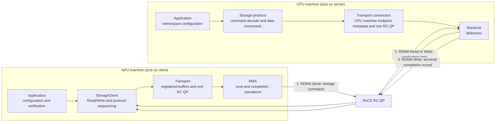

# NPU Direct Storage (NDS)

NDS enables an Ascend NPU device to connect through its own RoCE RNIC to a
remote RoCE endpoint and submit storage requests. The NPU machine acts as the
client. The CPU machine acts as the server, owns a memory-backed namespace,
and performs the data movement through `libibverbs`.

## Architecture



The NPU client uses one dependency direction: application to `StorageClient`
to `Transport` to RMA. The current RMA binding is RoCE QP/CQ; the CPU machine owns the
namespace and data movement. See [architecture](docs/architecture.md).

## NPU execution modes

NDS provides three execution modes for NPU-side work requests.

Here, **NPU device** means the Ascend accelerator in the NPU machine, and
**host CPU** means the CPU in that machine.

| Execution mode | RDMA-post execution site | Local completion | Guide |
|---|---|---|---|
| `ra` | Host CPU: RA Send plus runtime doorbell | RA CQ is available | [RA](docs/npu-backends.md#ra) |
| `aiv` | NPU AIV: direct SQ/RQ/CQ and doorbell access | Caller-owned SCQ/RCQ polling | [AIV](docs/npu-backends.md#aiv) |
| `aicpu` | NPU CP1: provider symbols first, queue-address fallback | Caller-owned SCQ/RCQ polling | [AICPU](docs/npu-backends.md#aicpu) |

The table identifies where the RDMA post executes, not where it is invoked.
An AIV or AICPU operator may be invoked from the host CPU or from another
operator on the NPU device.

The current executable uses the host CPU for lifecycle, QP/MR setup, storage
command construction, operator launch, and completion observation. AIV and
AICPU currently implement the work-request layer; device-callable Transport
and StorageClient APIs are planned.

The execution modes share the same host HCCP rdev/QP and memory-registration
control path. Their QP types, post paths, CQ ownership, and current limitations
differ; see [HCCP QP and MR lifecycle](docs/hccp-resources.md) and
[NPU execution modes](docs/npu-backends.md).

The CPU actively polls its verbs CQ for both the command Receive and its
signaled completion Write. For a storage Write, arrow 2 is an RDMA Read issued
by the CPU machine from the application buffer on the NPU device; for a storage
Read, it is an RDMA Write issued by the CPU machine to that buffer. The NPU
machine treats arrow 3's completion record, also written by the CPU machine,
as the command result. An operator launch, HCCP internal AI-QP CQ processing,
and an RA local CQE are not this protocol completion.

## Repository layout

```text
src/client/       NPU client: control plane plus RA / AIV / AICPU data planes
src/server/       CPU machine acting as server: protocol, transport, and verbs backend
src/common/       Shared transport bootstrap/metadata, storage ABI, and logging
tests/            Unit/integration tests and opt-in hardware probes
docs/             Resource lifecycle, modes, linkage, and implementation guides
```

The headers in `src/include/nds/` are shared internal interfaces, named
with an `nds/` prefix to avoid collisions. NDS does not currently install an
external SDK.

Host C++ operations return `nds::Result<T>`. NDS uses this for expected
runtime, RA, RMA, transport, and protocol failures rather than exceptions or
a separate boolean and error-output parameter.

## Build

Build and test only on the matching aarch64 CANN target. Do not build or test
on a development Mac.

```sh
cmake -S . -B build -DCMAKE_BUILD_TYPE=Release
cmake --build build --parallel
ctest --test-dir build --output-on-failure
```

Device-kernel builds and mode-specific invocation are documented in the mode
guides. Keep target paths, addresses, logs, and operational commands in ignored
`.local/` files.

## Documentation

NDS's QP creation, queue manipulation, doorbell, and provider-ABI knowledge
was learned from public HCOMM, HCCL, rdma-core, and Ascend repositories. See
the [open-source reference basis](docs/open-source-references.md) for the
specific sources and limits.

**System design**

- [C++ code style](docs/code-style.md): API outputs, error propagation,
  ownership, formatting, and executable conventions.
- [Architecture](docs/architecture.md): ownership boundaries and the storage
  protocol.
- [HCCP QP, MR, and runtime ABI](docs/hccp-resources.md): resource ownership,
  bootstrap, teardown, and the runtime library boundary.
- [NPU execution modes](docs/npu-backends.md): RA, AIV, and AICPU posting paths.
- [PyTorch wrappers](docs/torch-wrappers.md): optional verbs, transport, and
  storage bindings for PyTorch tensors.

**Runtime and evidence**

- [Open-source reference basis](docs/open-source-references.md): public source
  material that informed NDS, with its limits.

**Validation and future work**

- [Testing](docs/testing.md): unit, integration, and opt-in hardware tests.
- [Protocol roadmap](docs/roadmap.md): next protocol and concurrency work.
