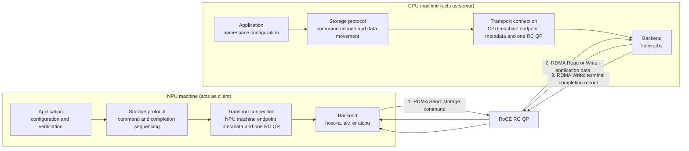

# NPU Direct Storage (NDS)

NDS enables an Ascend NPU device to connect through its own RoCE RNIC to a
remote RoCE endpoint and submit storage requests. The NPU machine acts as the
client. The CPU machine acts as the server, owns a memory-backed namespace,
and performs the data movement through `libibverbs`.

## Architecture



Both machines use the same four-layer dependency direction: application to
storage protocol to transport connection to backend. The CPU machine owns the
namespace and data movement. The NPU machine's backend owns the mode-specific
command post. See [architecture](docs/architecture.md).

## NPU machine backends

NDS provides three backends for the NPU machine.

Here, **NPU device** means the Ascend accelerator in the NPU machine, and
**host CPU** means the CPU in that machine.

| Backend | RDMA-post execution site | Local completion | Guide |
|---|---|---|---|
| `host-ra` | Host CPU: RA Send plus runtime doorbell | Host RA CQ is available | [Host RA](docs/npu-backends.md#host-ra) |
| `aiv` | NPU device AIV kernel: writes one Send WQE and doorbell | HCCP internal AI-QP handling; future AIV backend handling | [AIV](docs/npu-backends.md#aiv) |
| `aicpu` | NPU device standard-CP1 operator: provider `post_send` | HCCP internal AI-QP handling; future AICPU backend handling | [AICPU](docs/npu-backends.md#aicpu) |

The table identifies where the RDMA post executes, not where it is invoked.
An AIV or AICPU operator may be invoked from the host CPU or from another
operator on the NPU device.

The current executable uses the host CPU for lifecycle, QP/MR setup, operator
launch, and completion observation. Its host launchers provide one runnable
invocation path; they are not requirements of the AIV or AICPU backends and
are not part of the device-side RDMA-post operation.

The backends share the same HCCP rdev/QP connection and
memory-registration lifecycle. Their QP types, post paths, CQ ownership, and
current limitations differ; see [HCCP QP and MR lifecycle](docs/hccp-resources.md)
and [NPU machine backends](docs/npu-backends.md).

The CPU actively polls its verbs CQ for both the command Receive and its
signaled completion Write. For a storage Write, arrow 2 is an RDMA Read issued
by the CPU machine from the application buffer on the NPU device; for a storage
Read, it is an RDMA Write issued by the CPU machine to that buffer. The NPU
machine treats arrow 3's completion record, also written by the CPU machine,
as the command result. A backend launch, HCCP internal AI-QP CQ processing,
and a host-RA local CQE are not this protocol completion.

## Repository layout

```text
src/client/       NPU machine acting as client: protocol, transport, and backends
src/server/       CPU machine acting as server: protocol, transport, and verbs backend
src/common/       Shared transport bootstrap/metadata, storage ABI, and logging
tests/            Unit tests and a test-only runtime fixture
docs/             Resource lifecycle, modes, linkage, and implementation guides
```

The headers in `src/common/include/nds/` are shared internal interfaces, named
with an `nds/` prefix to avoid collisions. NDS does not currently install an
external SDK.

Host C++ operations return `nds::Result<T>`. NDS uses this for expected
runtime, RA, verbs, transport, and protocol failures rather than exceptions or
a separate boolean and error-output parameter.

## Build

Build and test only on the matching aarch64 CANN target. Do not build or test
on a development Mac.

```sh
cmake -S . -B build -DCMAKE_BUILD_TYPE=Release
cmake --build build --parallel
ctest --test-dir build --output-on-failure
```

Device-kernel builds and mode-specific invocation are documented in the mode
guides. Keep target paths, addresses, logs, and operational commands in ignored
`.local/` files.

## Documentation

NDS's QP creation, queue manipulation, doorbell, and provider-ABI knowledge
was learned from public HCOMM, HCCL, rdma-core, and Ascend repositories. See
the [open-source reference basis](docs/open-source-references.md) for the
specific sources and limits.

**System design**

- [Architecture](docs/architecture.md): ownership boundaries and the storage
  protocol.
- [HCCP QP and MR lifecycle](docs/hccp-resources.md): resource ownership,
  bootstrap, and teardown.
- [NPU machine backends](docs/npu-backends.md): Host RA, AIV, and AICPU posting paths.

**Runtime and evidence**

- [Runtime libraries and ABI](docs/runtime-abi.md): linked libraries, dynamic
  loaders, provider boundary, and runtime invariants.
- [Open-source reference basis](docs/open-source-references.md): public source
  material that informed NDS, with its limits.

**Validation and future work**

- [Testing](docs/testing.md): unit, integration, and opt-in hardware tests.
- [Protocol roadmap](docs/roadmap.md): next protocol and concurrency work.
